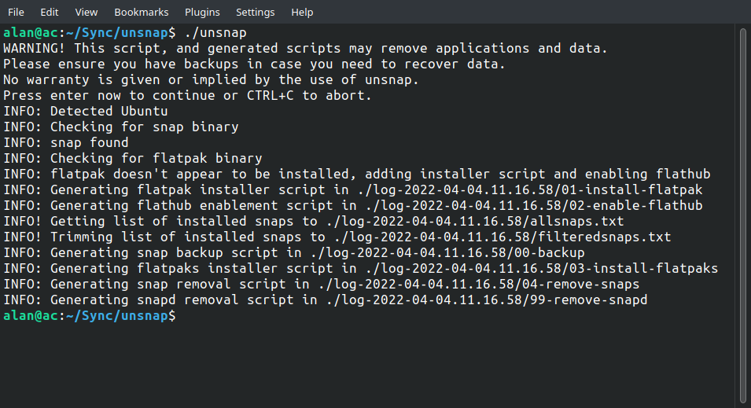

<h1 align="center">
  
  <br />
  unsnap
</h1>

<p align="center"><b>Quickly migrate from using snap packages to flatpaks.</b></p>
<div align="center"></div>
<p align="center">Made with 💝 for </p>

## Introduction

Quickly and easily migrate from using `snap` for applications to `flatpak`. unsnap runs as a two-stage process. unsnap itself generates the scripts to do the actual migration. This enables users to view and/or edit the scripts prior to execution to validate or tweak them.

## Project Status

Let's say it's "Pre-alpha", as in "*It kinda works on my computer*".

Unless you plan on contributing (see below) it's probably not ready for you, yet.

We have a Discord for this project:
[](https://discord.gg/dk55RrnZyq)

## Running unsnap

Simply clone this repo and then run `unsnap`. After some warnings and checks, this will generate a set of scripts. Run those generated scripts in sequence to achieve unsnappyness.

``` {.bash}
git clone https://github.com/popey/unsnap
cd unsnap
./unsnap
```

Alternatively run `unsnap` with the `auto` option to generate **and** run the scripts immediately.

``` {.bash}
./unsnap auto
```

## Generated Scripts

These scripts are generated by unsnap.

* **00-backup** - runs `snap save` for each installed snap being migrated
* **01-install-flatpak** - if not already installed, will install flatpak package manager
* **02-enable-flathub** - if not enabled, will add the remote flathub location in flatpak
* **03-install-flatpaks** - installs equivalent flatpaks for each identified snap
* **04-remove-snaps** - removes snaps for which the flatpaks have been installed
* **99-remove-snapd** - removes `snapd` itself, which will remove all snaps

## Package Mapping

unsnap ships with a csv file that contains a mapping of snap package names to flatpak names. This is a one to one mapping. The list is not complete, but contains a subset of applications available in the snap store and flathub. Contributions to this list are most welcome

## Check Mode

To facilitate checking the snap and flatpak names in the applist.csv file, unsnap has an "check" mode. This simply runs through the `applist.csv` file to check for the existence of every snap and flatpak listed. For this mode to work, both the snap and flatpak commands should be installed. This is an unsnap developer feature, and typically isn't required to be run by users.

``` {.bash}
unsnap check
```

*Note*: In this mode, no scripts are generated, no data is changed, and no flatpaks are installed, but an `unsnap.log`file is generated.

## Application data

Currently unsnap runs a `snap save` for each snap being migrated. This uses the `snapd` internal mechanism to backup application data. You should ensure you have enough disk space and time for this operation, as some applications will have a lot of data to backup.

More information about `snap save` can be found in the [snap snapshots documentation](https://snapcraft.io/docs/snapshots).

The backup can be skipped by omitting running the backup scripts before starting the migration proper.

The backups made with `snap save` are (by default) stored in `/var/lib/snapd/snapshots` as zip files.

It's (currently) left as an exercise for the user, to actually *restore* the data, should they need to.

## Logging

unsnap writes to the console, and to a log file called `unsnap.log` in `./log-YYYY-MM-DD.HH.MM.SS` beneath the current directory.

## Excluded snaps

There's a list of snaps in `excluded_snaps.txt` which are packages from the snap store for which there's no real equivalent in flathub. This includes snaps like `bare`, `core18`, and `core20`. As such we don't want to prompt to migrate people from these to some other flatpak.

*Note*: Yes, I know there are *conceptually* equivalent packages in flathub to these, but those get pulled in as part of the application installs, and do not require management by unsnap itself.

## Contributions

I knocked this prototype up over the weekend, but it's far from complete. Here's some features that aren't yet complete. Contributions welcome!

* Support distributions other than Ubuntu
  * According to [snapcraft core18 store page](https://snapcraft.io/core18) (which I have no reason to disbelieve), the following distros are most popular in terms of snaps installed: Manjaro, Linux Mint, Zorin, Debian, Fedora, Pop_OS!, KDE Neon, Raspbian, Centos, elementary OS.
* Update `applist.csv` to be a more complete list of migratable applications
  * Consider [submitting](https://github.com/popey/unsnap/issues/new?assignees=&labels=&template=missing-flatpak-report.md&title=) the `missingflatpak.txt` report from running `unsnap` here
* Update `excluded_snaps.txt` to contain further examples of non-migratable applications
* Add feature to migrate data from the common snap directories to places flatpak'ed applications can find them
  * This is a bit hard and may need special cases for some applications. For example 'classic' snaps may store data anywhere, whereas well-confined applications might store in the snap-specific directories.

## Example Generated Script Output

In this example I installed all the 'featured' snaps (output of `snap find`) on my laptop then ran `unsnap` which generated these scripts.

### 00-backup

``` {.bash}
#!/usr/bin/env bash
# Documentation: https://snapcraft.io/docs/snapshots
snap save bitwarden blix cecconoid chromium discord firefox flock-chat gimp kdenlive keepassxc krita libreoffice liveforspeed obs-studio onlyoffice-desktopeditors pinta skype slack spotify telegram-desktop thunderbird typeapp-mail vidcutter vlc warble 
```

### 01-install-flatpak

``` {.bash}
#!/usr/bin/env bash
# Documentation: https://flatpak.org/setup/Ubuntu
sudo apt update
sudo apt install flatpak
# sudo apt install gnome-software-plugin-flatpak
```

### 02-enable-flathub

``` {.bash}
#!/usr/bin/env bash
sudo flatpak remote-add --if-not-exists flathub https://flathub.org/repo/flathub.flatpakrepo
```

### 03-install-flatpaks

``` {.bash}
#!/usr/bin/env bash
for f in com.bitwarden org.chromium.Chromium com.discordapp.Discord org.mozilla.firefox org.gimp.GIMP org.kde.kdenlive org.keepassxc.KeePassXC org.kde.krita org.libreoffice.LibreOffice com.obsproject.Studio org.onlyoffice com.github.PintaProject.Pinta com.skype.Client com.slack.Slack com.spotify.Client org.mozilla.Thunderbird com.ozmartians.VidCutter org.videolan.VLC  ; do
  flatpak install flathub --noninteractive -y $f
done
```

### 04-remove-snaps

``` {.bash}
#!/usr/bin/env bash
for s in bitwarden blix cecconoid chromium discord firefox flock-chat gimp kdenlive keepassxc krita libreoffice liveforspeed obs-studio onlyoffice-desktopeditors pinta skype slack spotify telegram-desktop thunderbird typeapp-mail vidcutter vlc warble  ; do
  snap remove $s 
done
```

### 99-remove-snapd

``` {.bash}
#!/usr/bin/env bash
echo Removing snapd
sudo apt remove snapd
```

### missingflatpak.txt

``` {.bash}
blix
cecconoid
flock-chat
liveforspeed
telegram-desktop
typeapp-mail
warble
```

## Friendly notice

*Note*: The existence of unsnap is merely a tool to enable users to switch from snapped applications to flatpak applications. This is not intended as a commentary or slight against any software. It's just a utility.